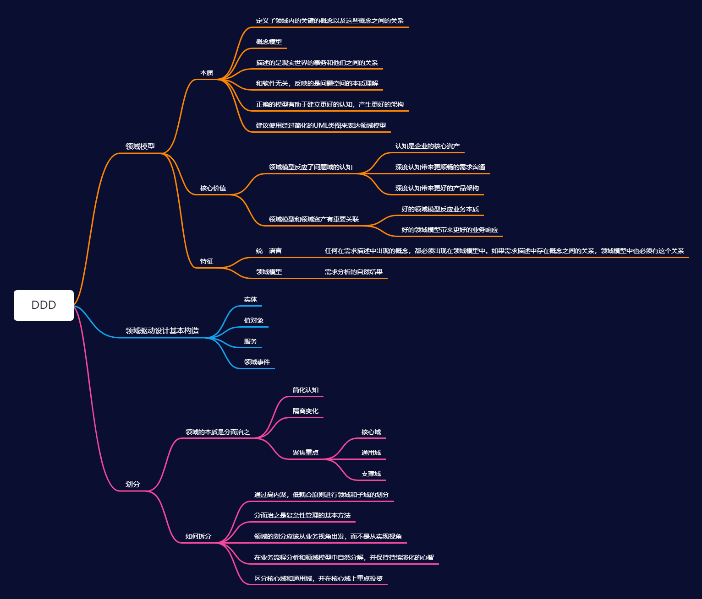

## DDD思维导图

## **常见相关问题**

### DDD概念　　

- DDD，全称Domain-Driven Design， 是一种处理复杂领域的设计思想，它试图分离技术实现的复杂性，并围绕业务概念构建领域模型来控制业务的复杂性，以解决软件难以理解，难以演进的问题。它通过边界划分将复杂业务领域简单化，帮我们设计出清晰的领域和应用边界，可以很容易地实现架构演进。

  DDD是面向对象的设计思想，是面向对象设计的一种升华。

- 领域驱动设计提出了一套核心构造块（Building Blocks，如聚合、实体、值对象、领域服务、领域工厂、仓储、领域事件，等）,这些构造块是对面向对象领域建模的一些核心最佳实践的浓缩。这些构造块可以使得我们的设计更加标准、有序。

#### 实体(Entity) & 值对象(Value Object)

实体与面向对象中的概念类似，在这里再次提出是因为它是领域模型的基本元素。在领域模型中，实体应该具有唯一的标识符，从设计的一开始就应该考虑实体，决定是否建立一个实体也是十分重要的。值对象和我们说的编程中数值类型的变量是不同的，它仅仅是没有唯一标识符的实体，比如有两个收获地址的信息完全一样，那它就是值对象，并不是实体。值对象在领域模型中是可以被共享的，他们应该是“不可变的”（只读的），当有其他地方需要用到值对象时，可以将它的副本作为参数传递。

#### 服务

当我们在分析某一领域时，一直在尝试如何将信息转化为领域模型，但并非所有的点我们都能用Model来涵盖。对象应当有属性，状态和行为，但有时领域中有一些行为是无法映射到具体的对象中的，我们也不能强行将其放入在某一个模型对象中，而将其单独作为一个方法又没有地方，此时就需要服务。服务是无状态的，对象是有状态的。所谓状态，就是对象的基本属性：高矮胖瘦，年轻漂亮。服务本身也是对象，但它却没有属性（只有行为），因此说是无状态的。
 服务存在的目的就是为领域提供简单的方法。为了提供大量便捷的方法，自然要关联许多领域模型，所以说，行为(Action)天生就应该存在于服务中。
 服务具有以下特点：

1. 服务中体现的行为一定是不属于任何实体和值对象的，但它属于领域模型的范围内
2. 服务的行为一定设计其他多个对象
3. 服务的操作是无状态的

#### 模块

对于一个复杂的应用来说，领域模型将会变的越来越大，以至于很难去描述和理解，更别提模型之间的关系了。模块的出现，就是为了组织统一的模型概念来达到减少复杂性的目的的。而另一个原因则是模块可以提高代码质量和可维护性，比如我们常说的高内聚，低耦合就是要提倡将相关的类内聚在一起实现模块化。模块应当有对外的统一接口供其他模块调用，比如有三个对象在模块a中，那么模块b不应该直接操作这三个对象，而是操作暴露的接口。模块的命名也很有讲究，最好能够深层次反映领域模型。
 聚合
 聚合被看作是多个模型单元间的组合，它定义了模型的关系和边界。每个聚合都有一个根，根是一个实体，并且是唯一可被外访问的。正是如此，聚合可以保证多个模型单元的不变性，因为其他模型都参考聚合的根。所以要想改变其他对象，只能通过聚合的根去操作。根如果没有了，那么聚合中的其他对象也将不存在。
 一个简单的例子如下：
 customer是该聚合的根，其他的都是内部对象，如果外部需要用户地址，拷贝一份传递出去即可。显而易见，用户如果不存在，其他信息均无意义。

#### 工厂

在大型系统中，实体和聚合通常是很复杂的，这就导致了很难去通过构造器来创建对象。工厂就决解了这个问题，它把创建对象的细节封装起来，巧妙的实现了依赖反转。当然对聚合也适用（当建立了聚合根时，其他对象可以自动创建）。工厂最早被大家熟知可能还是在设计模式中，的确，在这里提到的工厂也是这个概念。但是不要盲目的去应用工厂，以下场景不需要工厂：

1. 构造器很简单
2. 构造对象时不依赖于其他对象的创建
3. 用策略模式就可以解决

#### 仓库

仓库封装了获取对象的逻辑，领域对象无须和底层数据库交互，它只需要从仓库中获取对象即可。仓库可以存储对象的引用，当一个对象被创建后，它可能会被存储到仓库中，那么下次就可以从仓库取。如果用户请求的数据没在仓库中，则会从数据库里取，这就减少了底层交互的次数。

### 统一语言

统一语言（Ubiquitous Language），是领域驱动设计中一个非常重要的概念。任何一个领域驱动设计的项目，都需要一种通用语言，一套通用的词汇。因为没有通用的语言，就没有一致的概念，沟通就会遇到障碍，最后的领域模型和软件也就无法满足领域内的真实业务需求。通用语言是领域专家和开发人员在对领域问题的沟通、需求的讨论、开发计划的制定、领域模型的设计，以及开发人员之间对领域模型的具体编码落地实现，等一系列过程中，所有人员使用的一种通用语言。话句话说，就是无论是沟通时所用的词汇、还是领域模型中的概念、还是代码中出现的类名与方法，只要是相同的意思，那就应该使用相同的词汇。可以看出，这种通用语言不是一下子就可以形成，而是在一个各方人员讨论的过程中，不断发现、明确，与精炼出来的。

### 模型驱动设计

- 分层架构：UI层，应用层，领域层以及基础设施层。

1. UI层（User Interface）
    负责向用户展现信息，并且会解析用户行为，即常说的展现层。
2. 应用层Application Layer
    应用层没有任何的业务逻辑代码，它很简单，它主要为程序提供任务处理。
3. 领域层Domain Layer
    这一层包含有关领域的信息，是业务的核心，领域模型的状态都直接或间接（持久化至数据库）存储在这一层。
4. 基础设施层Infrastructure Layer
    为其他层提供底层依赖操作。
    层结构的划分是很有必要的，只有清晰的结构，那么最终的领域设计才宜用，比如用户要预定航班，向Application Layer的service发起请求，而后Domain Layler从Infrastructure Layer获取领域对象，校验通过后会更新用户状态，最后再次通过Infratructure Layer持久化到数据库中。

### DDD设计的步骤

1. 根据需求划分出领域、限界上下文；
2. 分析每一个限界上下文中的实体、值对象；

3. 聚合实体、值对象，划分出聚合范围、聚合根；

4. 设计聚合根的仓储；

5. 实际操作，不断反馈，迭代模型。不过只谈概念不实践，便是耍流氓。

