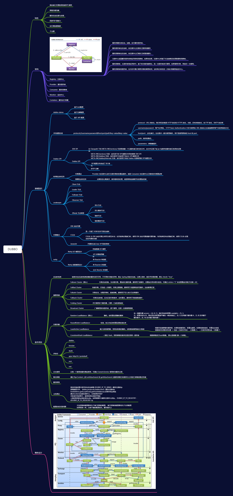

## Dubbo思维导图

## **常见相关问题**

### Dubbo集群的负载均衡有哪些策略　　

- Random LoadBalance: 随机选取提供者策略，有利于动态调整提供者权重。截面碰撞率高，调用次数越多，分布越均匀；

- RoundRobin LoadBalance: 轮循选取提供者策略，平均分布，但是存在请求累积的问题；
- LeastActive LoadBalance: 最少活跃调用策略，解决慢提供者接收更少的请求；
- ConstantHash LoadBalance: 一致性Hash策略，使相同参数请求总是发到同一提供者，一台机器宕机，可以基于虚拟节点，分摊至其他提供者，避免引起提供者的剧烈变动；

### Dubbo支持哪些协议

- dubbo： 单一长连接和NIO异步通讯，适合大并发小数据量的服务调用，以及消费者远大于提供者。传输协议TCP，异步，Hessian序列化；
- rmi： 采用JDK标准的rmi协议实现，传输参数和返回参数对象需要实现Serializable接口，使用java标准序列化机制，使用阻塞式短连接，传输数据包大小混合，消费者和提供者个数差不多，可传文件，传输协议TCP。 多个短连接，TCP协议传输，同步传输，适用常规的远程服务调用和rmi互操作。在依赖低版本的Common-Collections包，java序列化存在安全漏洞；
- webservice： 基于WebService的远程调用协议，集成CXF实现，提供和原生WebService的互操作。多个短连接，基于HTTP传输，同步传输，适用系统集成和跨语言调用；
- http： 基于Http表单提交的远程调用协议，使用Spring的HttpInvoke实现。多个短连接，传输协议HTTP，传入参数大小混合，提供者个数多于消费者，需要给应用程序和浏览器JS调用；
- hessian： 集成Hessian服务，基于HTTP通讯，采用Servlet暴露服务，Dubbo内嵌Jetty作为服务器时默认实现，提供与Hession服务互操作。多个短连接，同步HTTP传输，Hessian序列化，传入参数较大，提供者大于消费者，提供者压力较大，可传文件；
- memcache： 基于memcached实现的RPC协议
- redis： 基于redis实现的RPC协议

### Dubbo框架设计一共划分了10个层：

- 服务接口层（Service）：该层是与实际业务逻辑相关的，根据服务提供方和服务消费方的业务设计对应的接口和实现。
- 配置层（Config）：对外配置接口，以ServiceConfig和ReferenceConfig为中心。
- 服务代理层（Proxy）：服务接口透明代理，生成服务的客户端Stub和服务器端Skeleton。
- 服务注册层（Registry）：封装服务地址的注册与发现，以服务URL为中心。
- 集群层（Cluster）：封装多个提供者的路由及负载均衡，并桥接注册中心，以Invoker为中心。
- 监控层（Monitor）：RPC调用次数和调用时间监控。
- 远程调用层（Protocol）：封将RPC调用，以Invocation和Result为中心，扩展接口为Protocol、Invoker和Exporter。
- 信息交换层（Exchange）：封装请求响应模式，同步转异步，以Request和Response为中心。
- 网络传输层（Transport）：抽象mina和netty为统一接口，以Message为中心。
- 数据序列化层（serialize）：可复用的一些工具，扩展接口为 `Serialization`, `ObjectInput`, `ObjectOutput`, `ThreadPoo`

### Dubbo的集群容错方案有哪些？

- Failover Cluster失败自动切换，当出现失败，重试其它服务器。通常用于读操作，但重试会带来更长延迟。   默认集群容错方案
- Failfast Cluster快速失败，只发起一次调用，失败立即报错。通常用于非幂等性的写操作，比如新增记录。
- Failsafe Cluster失败安全，出现异常时，直接忽略。通常用于写入审计日志等操作。
- Failback Cluster失败自动恢复，后台记录失败请求，定时重发。通常用于消息通知操作。
- Forking Cluster并行调用多个服务器，只要一个成功即返回。通常用于实时性要求较高的读操作，但需要浪费更多服务资源。可通过 forks="2" 来设置最大并行数。
- Broadcast Cluster广播调用所有提供者，逐个调用，任意一台报错则报错 。通常用于通知所有提供者更新缓存或日志等本地资源信息。

### Hessian协议

Hessian的对象有八种原始类型：

1. 原生二进制数据
2. Boolean
3. 64位毫秒值的日期
4. 64位double
5. 32位int
6. 64位long
7. null
8. utf-8的string

它有三种循环的类型：

1. list for lists and arrays
2. map for maps and dictionaries
3. object for objects

最后，他有一种特殊组成:

1. 共享和循环对象引用