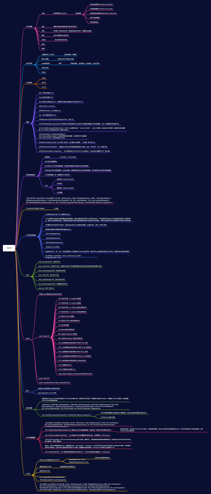

## JVM思维导图**

## **常见相关问题**

### 类加载过程

加载、验证、准备、解析、初始化、使用、卸载

<clinit>与<init>

static 代码块只会执行一次，它对应的是 <clinit> 方法

初始化对象的属性 对应的是<init>。每次新建对象的时候，都会执行

### 如何替换 JDK 的类

当 Java 的原生 API 不能满足需求时，比如我们要修改 HashMap 类，就必须要使用到 Java 的 endorsed 技术。我们需要将自己的 HashMap 类，打包成一个 jar 包，然后放到 -Djava.endorsed.dirs 指定的目录中。注意类名和包名，应该和 JDK 自带的是一样的。但是，java.lang 包下面的类除外，因为这些都是特殊保护的。

Java 提供了 endorsed 技术，用于替换这些类。这个目录下的 jar 包，会比 rt.jar 中的文件，优先级更高，可以被最先加载到。

### GC Roots 有哪些

- Java 线程中，当前所有正在被调用的方法的引用类型参数、局部变量、临时值等。也就是与我们栈帧相关的各种引用。
- 所有当前被加载的 Java 类。
- Java 类的引用类型静态变量。
- 运行时常量池里的引用类型常量（String 或 Class 类型）。
- JVM 内部数据结构的一些引用，比如 sun.jvm.hotspot.memory.Universe 类。
- 用于同步的监控对象，比如调用了对象的 wait() 方法。
- JNI handles，包括 global handles 和 local handles。

总结如下：

活动线程相关的各种引用。
类的静态变量的引用。
JNI 引用

###  CMS 垃圾回收器

初始标记   STW

并发标记

重新标记   STW

并发清理

