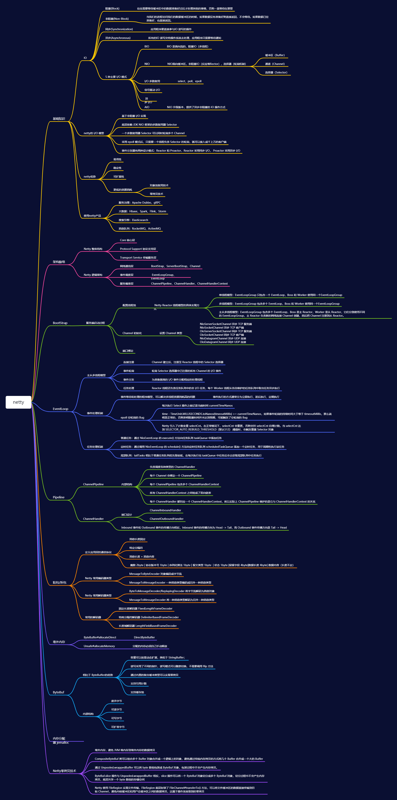

## Netty思维导图

## **常见相关问题**

### BIO、NIO和AIO的区别

BIO：一个连接一个线程，客户端有连接请求时服务器端就需要启动一个线程进行处理。线程开销大。
伪异步IO：将请求连接放入线程池，一对多，但线程还是很宝贵的资源。
NIO：一个请求一个线程，但客户端发送的连接请求都会注册到多路复用器上，多路复用器轮询到连接有I/O请求时才启动一个线程进行处理。
AIO：一个有效请求一个线程，客户端的I/O请求都是由OS先完成了再通知服务器应用去启动线程进行处理

BIO是面向流的，NIO是面向缓冲区的；BIO的各种流是阻塞的。而NIO是非阻塞的；BIO的Stream是单向的，而NIO的channel是双向的。
NIO的特点：事件驱动模型、单线程处理多任务、非阻塞I/O，I/O读写不再阻塞，而是返回0、基于block的传输比基于流的传输更高效、更高级的IO函数zero-copy、IO多路复用大大提高了Java网络应用的可伸缩性和实用性。基于Reactor线程模型。

### NIO的组成

Buffer：与Channel进行交互，数据是从Channel读入缓冲区，从缓冲区写入Channel中的
flip方法 ： 反转此缓冲区，将position给limit，然后将position置为0，其实就是切换读写模式
clear方法 ：清除此缓冲区，将position置为0，把capacity的值给limit。
rewind方法 ： 重绕此缓冲区，将position置为0
DirectByteBuffer可减少一次系统空间到用户空间的拷贝。但Buffer创建和销毁的成本更高，不可控，通常会用内存池来提高性能。直接缓冲区主要分配给那些易受基础系统的本机I/O 操作影响的大型、持久的缓冲区。如果数据量比较小的中小应用情况下，可以考虑使用heapBuffer，由JVM进行管理。
Channel：表示 IO 源与目标打开的连接，是双向的，但不能直接访问数据，只能与Buffer 进行交互。通过源码可知，FileChannel的read方法和write方法都导致数据复制了两次
Selector可使一个单独的线程管理多个Channel，open方法可创建Selector，register方法向多路复用器器注册通道，可以监听的事件类型：读、写、连接、accept。注册事件后会产生一个SelectionKey：它表示SelectableChannel 和Selector 之间的注册关系，wakeup方法：使尚未返回的第一个选择操作立即返回，唤醒的原因是：注册了新的channel或者事件；channel关闭，取消注册；优先级更高的事件触发（如定时器事件），希望及时处理。
Selector在Linux的实现类是EPollSelectorImpl，委托给EPollArrayWrapper实现，其中三个
native方法是对epoll的封装，而EPollSelectorImpl. implRegister方法，通过调用epoll_ctl向epoll实例中注册事件，还将注册的文件描述符(fd)与SelectionKey的对应关系添加到fdToKey中，这个map维护了文件描述符与SelectionKey的映射。
fdToKey有时会变得非常大，因为注册到Selector上的Channel非常多（百万连接）；过期或失效的Channel没有及时关闭。fdToKey总是串行读取的，而读取是在select方法中进行的，该方法是非线程安全的。
Pipe：两个线程之间的单向数据连接，数据会被写到sink通道，从source通道读取
NIO的服务端建立过程：Selector.open()：打开一个Selector；ServerSocketChannel.open()：创建服务端的Channel；bind()：绑定到某个端口上。并配置非阻塞模式；register()：注册Channel和关注的事件到Selector上；select()轮询拿到已经就绪的事件

### Netty的特点

一个高性能、异步事件驱动的NIO框架，它提供了对TCP、UDP和文件传输的支持
使用更高效的socket底层，对epoll空轮询引起的cpu占用飙升在内部进行了处理，避免了直接使用NIO的陷阱，简化了NIO的处理方式。
采用多种decoder/encoder 支持，对TCP粘包/分包进行自动化处理
可使用接受/处理线程池，提高连接效率，对重连、心跳检测的简单支持
可配置IO线程数、TCP参数， TCP接收和发送缓冲区使用直接内存代替堆内存，通过内存池的方式循环利用ByteBuf
通过引用计数器及时申请释放不再引用的对象，降低了GC频率
使用单线程串行化的方式，高效的Reactor线程模型
大量使用了volitale、使用了CAS和原子类、线程安全类的使用、读写锁的使用

### Netty的线程模型

Netty通过Reactor模型基于多路复用器接收并处理用户请求，内部实现了两个线程池，boss线程池和work线程池，其中boss线程池的线程负责处理请求的accept事件，当接收到accept事件的请求时，把对应的socket封装到一个NioSocketChannel中，并交给work线程池，其中work线程池负责请求的read和write事件，由对应的Handler处理。
**单线程模型：**所有I/O操作都由一个线程完成，即多路复用、事件分发和处理都是在一个Reactor线程上完成的。既要接收客户端的连接请求,向服务端发起连接，又要发送/读取请求或应答/响应消息。一个NIO 线程同时处理成百上千的链路，性能上无法支撑，速度慢，若线程进入死循环，整个程序不可用，对于高负载、大并发的应用场景不合适。
**多线程模型：**有一个NIO 线程（Acceptor） 只负责监听服务端，接收客户端的TCP 连接请求；NIO 线程池负责网络IO 的操作，即消息的读取、解码、编码和发送；1 个NIO 线程可以同时处理N 条链路，但是1 个链路只对应1 个NIO 线程，这是为了防止发生并发操作问题。但在并发百万客户端连接或需要安全认证时，一个Acceptor 线程可能会存在性能不足问题。
**主从多线程模型：**Acceptor 线程用于绑定监听端口，接收客户端连接，将SocketChannel 从主线程池的Reactor 线程的多路复用器上移除，重新注册到Sub 线程池的线程上，用于处理I/O 的读写等操作，从而保证mainReactor只负责接入认证、握手等操作；

### TCP 粘包/拆包的原因及解决方法

TCP是以流的方式来处理数据，一个完整的包可能会被TCP拆分成多个包进行发送，也可能把小的封装成一个大的数据包发送。
TCP粘包/分包的原因：
应用程序写入的字节大小大于套接字发送缓冲区的大小，会发生拆包现象，而应用程序写入数据小于套接字缓冲区大小，网卡将应用多次写入的数据发送到网络上，这将会发生粘包现象；
进行MSS大小的TCP分段，当TCP报文长度-TCP头部长度>MSS的时候将发生拆包
以太网帧的payload（净荷）大于MTU（1500字节）进行ip分片。
解决方法
消息定长：FixedLengthFrameDecoder类
包尾增加特殊字符分割：行分隔符类：LineBasedFrameDecoder或自定义分隔符类 ：DelimiterBasedFrameDecoder
将消息分为消息头和消息体：LengthFieldBasedFrameDecoder类。分为有头部的拆包与粘包、长度字段在前且有头部的拆包与粘包、多扩展头部的拆包与粘包。

### Netty的零拷贝实现

Netty的接收和发送ByteBuffer采用DIRECT BUFFERS，使用堆外直接内存进行Socket读写，不需要进行字节缓冲区的二次拷贝。堆内存多了一次内存拷贝，JVM会将堆内存Buffer拷贝一份到直接内存中，然后才写入Socket中。ByteBuffer由ChannelConfig分配，而ChannelConfig创建ByteBufAllocator默认使用Direct Buffer
CompositeByteBuf 类可以将多个 ByteBuf 合并为一个逻辑上的 ByteBuf, 避免了传统通过内存拷贝的方式将几个小Buffer合并成一个大的Buffer。addComponents方法将 header 与 body 合并为一个逻辑上的 ByteBuf, 这两个 ByteBuf 在CompositeByteBuf 内部都是单独存在的, CompositeByteBuf 只是逻辑上是一个整体
通过 FileRegion 包装的FileChannel.tranferTo方法 实现文件传输, 可以直接将文件缓冲区的数据发送到目标 Channel，避免了传统通过循环write方式导致的内存拷贝问题。
通过 wrap方法, 我们可以将 byte[] 数组、ByteBuf、ByteBuffer等包装成一个 Netty ByteBuf 对象, 进而避免了拷贝操作。
**Selector BUG**：若Selector的轮询结果为空，也没有wakeup或新消息处理，则发生空轮询，CPU使用率100%，
**Netty的解决办法**：对Selector的select操作周期进行统计，每完成一次空的select操作进行一次计数，若在某个周期内连续发生N次空轮询，则触发了epoll死循环bug。重建Selector，判断是否是其他线程发起的重建请求，若不是则将原SocketChannel从旧的Selector上去除注册，重新注册到新的Selector上，并将原来的Selector关闭。