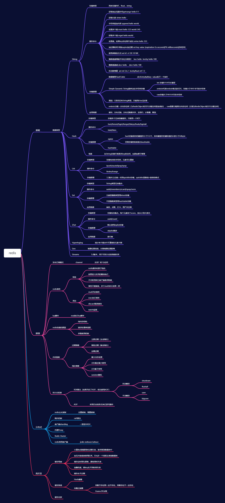

## Redis思维导图

## **常见相关问题**

### Redis 有哪些功能？

- 数据缓存功能
- 分布式锁的功能
- 支持数据持久化
- 支持事务
-  支持消息队列

### Redis 为什么是单线程的？

因为 cpu 不是 Redis 的瓶颈，Redis 的瓶颈最有可能是机器内存或者网络带宽。既然单线程容易实现，而且 cpu 又不会成为瓶颈，那就顺理成章地采用单线程的方案了。
关于 Redis 的性能，官方网站也有，普通笔记本轻松处理每秒几十万的请求。
而且单线程并不代表就慢 nginx 和 nodejs 也都是高性能单线程的代表。

### Redis 支持的数据类型有哪些？

Redis 支持的数据类型：string（字符串）、list（列表）、hash（字典）、set（集合）、zset（有序集合）。

### Redis 支持的 Java 客户端都有哪些？

支持的 Java 客户端有 Redisson、jedis、lettuce 等。

### jedis 和 Redisson 有哪些区别？

jedis：提供了比较全面的 Redis 命令的支持。
Redisson：实现了分布式和可扩展的 Java 数据结构，与 jedis 相比 Redisson 的功能相对简单，不支持排序、事务、管道、分区等 Redis 特性。

### 怎么保证缓存和数据库数据的一致性？

合理设置缓存的过期时间。
新增、更改、删除数据库操作时同步更新 Redis，可以使用事物机制来保证数据的一致性。

### Redis 持久化有几种方式？

Redis 的持久化有两种方式，或者说有两种策略：
 RDB（Redis Database）：指定的时间间隔能对你的数据进行快照存储。
AOF（Append Only File）：每一个收到的写命令都通过write函数追加到文件中。

### 缓存穿透、缓存击穿、缓存雪崩解决方案？

- 缓存穿透：指查询一个一定不存在的数据，如果从存储层查不到数据则不写入缓存，这将导致这个不存在的数据每次请求都要到DB去查询，可能导致DB挂掉。
  解决方案：1.查询返回的数据为空，仍把这个空结果进行缓存，但过期时间会比较短；

  ​					2.布隆过滤器：将所有可能存在的数据哈希到一个足够大的bitmap中，一个一定不存在的数据会被这个bitmap拦截掉，从而避免了对DB的查询。

- 缓存击穿：对于设置了过期时间的key，缓存在某个时间点过期的时候，恰好这时间点对这个Key有大量的并发请求过来，这些请求发现缓存过期一般都会从后端DB加载数据并回设到缓存，这个时候大并发的请求可能会瞬间把DB压垮。
  解决方案：1.使用互斥锁：当缓存失效时，不立即去load db，先使用如Redis的setnx去设置一个互斥锁，当操作成功返回时再进行load db的操作并回设缓存，否则重试get缓存的方法。

  ​					2.永远不过期：物理不过期，但逻辑过期（后台异步线程去刷新）。

- 缓存雪崩：设置缓存时采用了相同的过期时间，导致缓存在某一时刻同时失效，请求全部转发到DB，DB瞬时压力过重雪崩。与缓存击穿的区别：雪崩是很多key，击穿是某一个key缓存。
  解决方案：将缓存失效时间分散开，比如可以在原有的失效时间基础上增加一个随机值，比如1-5分钟随机，这样每一个缓存的过期时间的重复率就会降低，就很难引发集体失效的事件。

  ​			加互斥锁或者使用队列，只允许一个线程去查询数据库

  ​            缓存定时预先更新，避免同时失效

  ​		    加随机值，使key在不同时间失效

  ​			缓存永不过期

