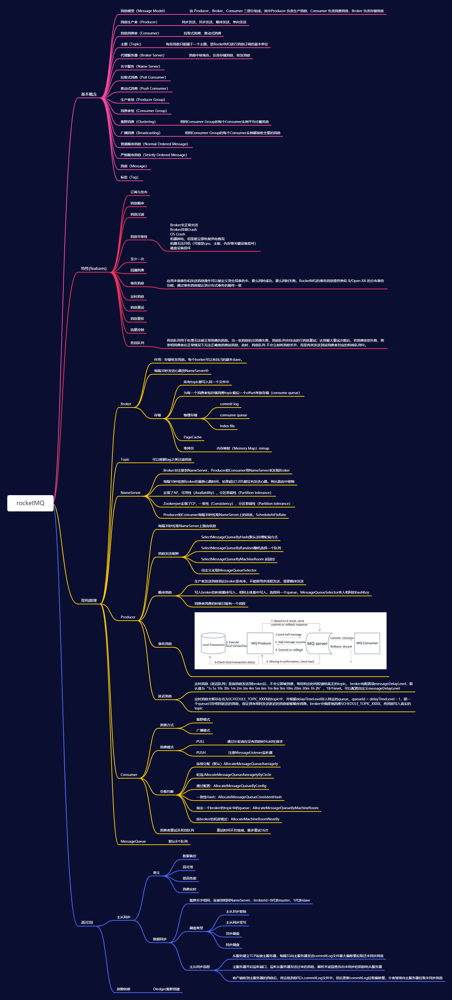
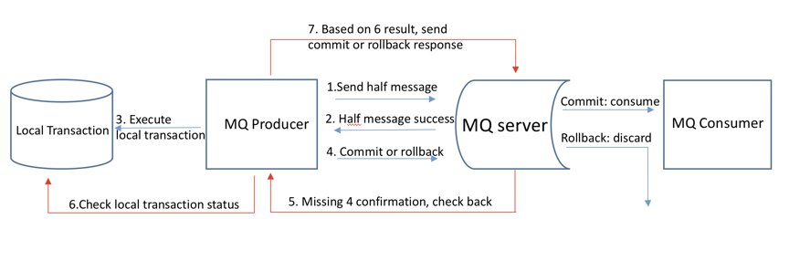
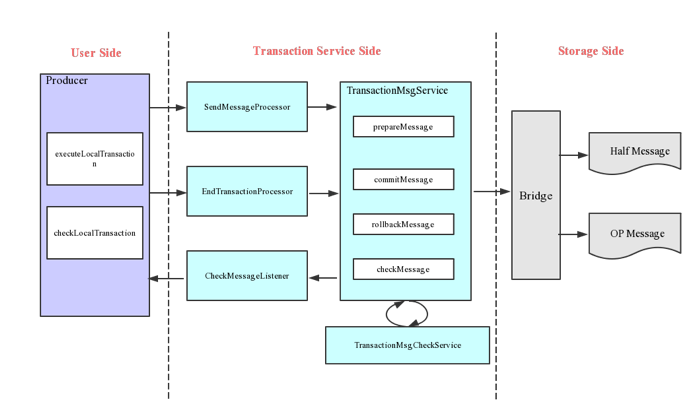
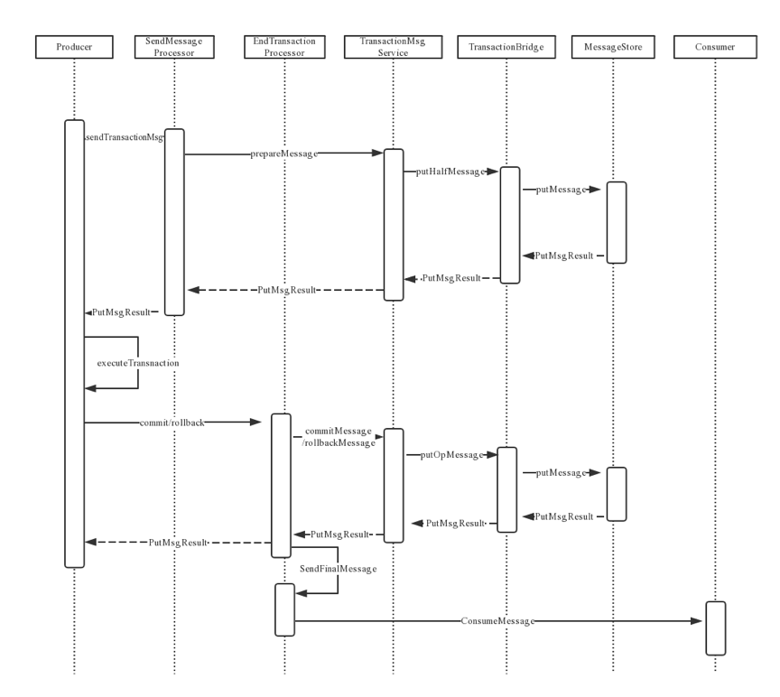
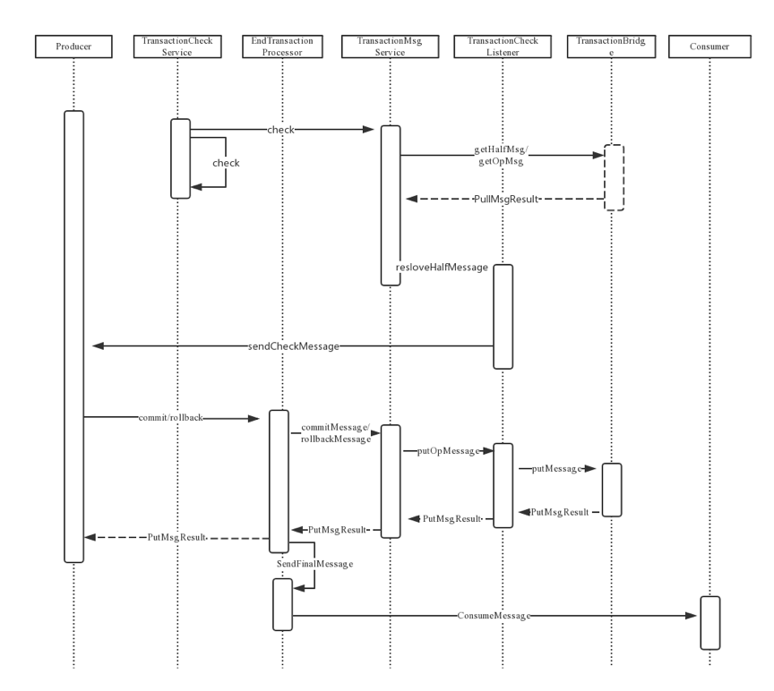

## RocketMQ思维导图

## **常见相关问题**

### **消息中间件的主要作用**

- 解耦：系统耦合度降低，没有强依赖关系
- 异步：不需要同步执行的远程调用可以有效提高响应时间
- 流量削峰：请求达到峰值后，后端服务还可以保持固定消费速率消费，不会被压垮

### RocketMQ主要角色及作用

RocketMQ主要由 Producer、Broker、Consumer 三部分组成，其中Producer 负责生产消息，Consumer 负责消费消息，Broker 负责存储消息。Broker 在实际部署过程中对应一台服务器，每个 Broker 可以存储多个Topic的消息，每个Topic的消息也可以分片存储于不同的 Broker。Message Queue 用于存储消息的物理地址，每个Topic中的消息地址存储于多个 Message Queue 中。ConsumerGroup 由多个Consumer 实例构成。

- 生产者Producer：负责生产消息，一般由业务系统负责生产消息。一个消息生产者会把业务应用系统里产生的消息发送到broker服务器。RocketMQ提供多种发送方式，同步发送、异步发送、顺序发送、单向发送。同步和异步方式均需要Broker返回确认信息，单向发送不需要。
- 消费者Consumer：负责消费消息，一般是后台系统负责异步消费。一个消息消费者会从Broker服务器拉取消息、并将其提供给应用程序。从用户应用的角度而言提供了两种消费形式：拉取式消费、推动式消费。
- 代理服务器Broker：消息中转角色，负责存储消息、转发消息。代理服务器在RocketMQ系统中负责接收从生产者发送来的消息并存储、同时为消费者的拉取请求作准备。代理服务器也存储消息相关的元数据，包括消费者组、消费进度偏移和主题和队列消息等。

- 名字服务Nameserver：充当路由消息的提供者。生产者或消费者能够通过名字服务查找各主题相应的Broker IP列表。多个Namesrv实例组成集群，但相互独立，没有信息交换。

### RocketMQ消费模式

消费模型由Consumer决定，消费维度为Topic

- 集群消费

> 1.一条消息只会被同Group中的一个Consumer消费
>
> 2.多个Group同时消费一个Topic时，每个Group都会有一个Consumer消费到数据

- 广播消费

> 消息将对一 个Consumer Group 下的各个 Consumer 实例都消费一遍。即即使这些 Consumer 属于同一个Consumer Group ，消息也会被 Consumer Group 中的每个 Consumer 都消费一次。

- 拉取式消费（Pull Consumer）：Consumer消费的一种类型，应用通常主动调用Consumer的拉消息方法从Broker服务器拉消息、主动权由应用控制。一旦获取了批量消息，应用就会启动消费过程。

- 推动式消费（Push Consumer）：Consumer消费的一种类型，该模式下Broker收到数据后会主动推送给消费端，该消费模式一般实时性较高。

  > push方式里，consumer把轮询过程封装了一层，并注册了MessageListener监听器。当轮询取到消息后，便唤醒MessageListener的consumeMessage()来消费，对用户而言，感觉好像消息是被推送过来的

### RocketMQ部署类型

- 单Master

  单机模式, 即只有一个Broker, 如果Broker宕机了, 会导致RocketMQ服务不可用, 不推荐使用

- 多Master模式

  组成一个集群, 集群每个节点都是Master节点, 配置简单, 性能也是最高, 某节点宕机重启不会影响RocketMQ服务

  缺点：如果某个节点宕机了, 会导致该节点存在未被消费的消息在节点恢复之前不能被消费

- 多Master多Slave模式，异步复制

  每个Master配置一个Slave, 多对Master-Slave, Master与Slave消息采用异步复制方式, 主从消息一致只会有毫秒级的延迟

  优点是弥补了多Master模式（无slave）下节点宕机后在恢复前不可订阅的问题。在Master宕机后, 消费者还可以从Slave节点进行消费。采用异步模式复制，提升了一定的吞吐量。总结一句就是，采用

- 多Master多Slave模式异步复制模式进行部署，

  系统将会有较低的延迟和较高的吞吐量

  缺点就是如果Master宕机, 磁盘损坏的情况下, 如果没有及时将消息复制到Slave, 会导致有少量消息丢失

- 多Master多Slave模式，同步双写

  与多Master多Slave模式，异步复制方式基本一致，唯一不同的是消息复制采用同步方式，只有master和slave都写成功以后，才会向客户端返回成功

  优点：数据与服务都无单点，Master宕机情况下，消息无延迟，服务可用性与数据可用性都非常高

  缺点就是会降低消息写入的效率，并影响系统的吞吐量	

实际部署中，一般会根据业务场景的所需要的性能和消息可靠性等方面来选择后两种

### RocketMq的存储机制

- 顺序写

  CommitLog的大小规定为1G

- 零拷贝

  零拷贝技术采用了MappedByteBuffer内存映射技术，采用这种技术有一些限制，其中有一条就是传输的文件不能超过2G，这也就是为什么RocketMq的存储消息的文件CommitLog的大小规定为1G的原因

RocketMq采用文件系统存储消息，并采用顺序写写入消息，使用零拷贝发送消息，极大得保证了RocketMq的性能

### RocketMq事务消息

1. 生产者向MQ服务器发送half消息。

2. MQ服务器回复生产者收到Half消息成功

3. 执行本地事务

4. 根据本地事务结果将提交或回滚消息发送到MQ服务器。

5. 如果缺少第四步，在执行本地事务期间提交/回滚消息丢失或生产者挂起，MQ server将向同一组中的每个生产者发送检查消息以获取事务状态。

6. 生产者检查本地事务状态

7. 根据第六步检查状态回复提交/回滚消息。

8. 提交的消息将交付给使用者，但回滚的消息将被MQ服务器丢弃。

   详情如下：

   

   

   