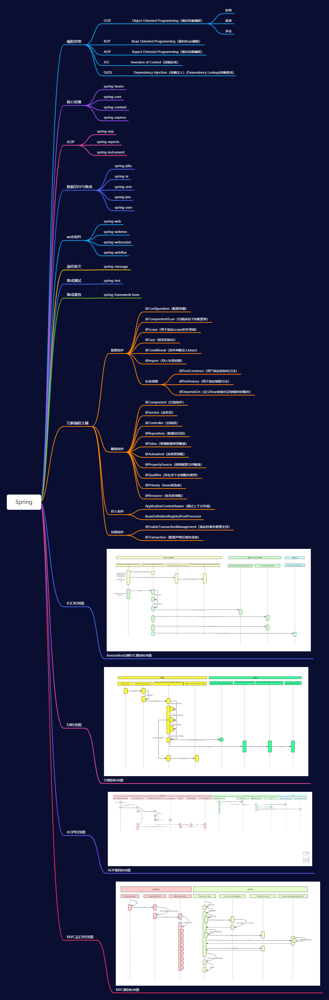

## Spring基础思维导图

## 什么是IOC/DI 

**控制反转** 所谓控制反转，就是把原先我们代 码里面需要实现的对象创建、依赖的代码，反转给容器来帮忙实现。 

**DI(Dependency Injection)依赖注入** 就是指对象是被动接受依赖类而不 是自己主动去找，换句话说就是指对象不是从容器中查找它依赖的类，而 是在容器实例化对象的时候主动将它依赖的类注入给它。

依赖注入的关键类

- 1、IOC容器 BeanFactory getBean() AbstractBeanFactory 
- 2、实例化策略 SimpleInstantiationStrategy 
- 3、存储实例所有相关的信息scope、proxy、instance BeanWrapper

依赖注入发生的时间 

- 1、用户第一次调用getBean()方法时。 
- 2、用户在配置文件中将<bean>元素配置了lazy-init=false属性， 即让容器在解析Bean定义时就触发注入

## BeanFactory和FactoryBean

- FactoryBean Spring内部实现一种规范&开头作为beanName Spring中的所有的容器都是FactoryBean 因为容器本身也由容器管理，root来创建， 都是单例放在IOC容器中 

- BeanFactory：Bean工厂的顶层规范，只是定义了getBean()方法

