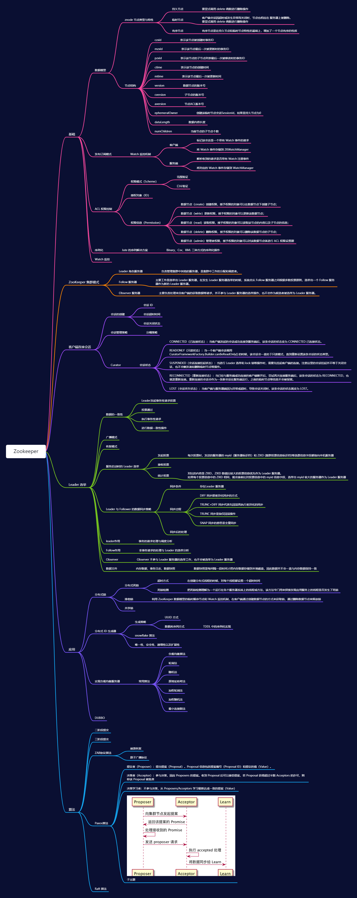

## Zookeeper思维导图

## **常见相关问题**

### ZooKeeper是什么？

ZooKeeper是一个分布式的，开放源码的分布式应用程序协调服务，是Google的Chubby一个开源的实现，它是集群的管理者，监视着集群中各个节点的状态根据节点提交的反馈进行下一步合理操作。最终，将简单易用的接口和性能高效、功能稳定的系统提供给用户。 客户端的读请求可以被集群中的任意一台机器处理，如果读请求在节点上注册了监听器，这个监听器也是由所连接的zookeeper机器来处理。对于写请求，这些请求会同时发给其他zookeeper机器并且达成一致后，请求才会返回成功。因此，随着zookeeper的集群机器增多，读请求的吞吐会提高但是写请求的吞吐会下降。 有序性是zookeeper中非常重要的一个特性，所有的更新都是全局有序的，每个更新都有一个唯一的时间戳，这个时间戳称为zxid（Zookeeper Transaction Id）。而读请求只会相对于更新有序，也就是读请求的返回结果中会带有这个zookeeper最新的zxid。

### 节点类型

- PERSISTENT-持久化目录节点 客户端与zookeeper断开连接后，该节点依旧存在 

- PERSISTENT_SEQUENTIAL-持久化顺序编号目录节点 客户端与zookeeper断开连接后，该节点依旧存在，只是Zookeeper给该节点名称进行顺序编号 

- EPHEMERAL-临时目录节点 客户端与zookeeper断开连接后，该节点被删除 

- EPHEMERAL_SEQUENTIAL-临时顺序编号目录节点。客户端与zookeeper断开连接后，该节点被删除，只是Zookeeper给该节点名称进行顺序编号

### 集群模式

在 ZooKeeper 集群中将服务器分成 Leader 、Follow 、Observer 三种角色服务器，在集群运行期间这三种服务器所负责的工作各不相同：

- Leader 角色服务器负责管理集群中其他的服务器，是集群中工作的分配和调度者。
- Follow 服务器的主要工作是选举出 Leader 服务器，在发生 Leader 服务器选举的时候，系统会从 Follow 服务器之间根据多数投票原则，选举出一个 Follow 服务器作为新的 Leader 服务器。
- Observer 服务器则主要负责处理来自客户端的获取数据等请求，并不参与 Leader 服务器的选举操作，也不会作为候选者被选举为 Leader 服务器。

### Zookeeper工作原理

Zookeeper 的核心是原子广播，这个机制保证了各个Server之间的同步。实现这个机制的协议叫做Zab协议。

Zab协议有两种模式，它们分别是恢复模式（选主）和广播模式（同步）。当服务启动或者在领导者崩溃后，Zab就进入了恢复模式，当领导者被选举出来，且大多数Server完成了和 leader的状态同步以后，恢复模式就结束了。状态同步保证了leader和Server具有相同的系统状态。

### Zookeeper 下 Server工作状态

每个Server在工作过程中有三种状态： 

LOOKING：当前Server不知道leader是谁，正在搜寻 

LEADING：当前Server即为选举出来的leader 

FOLLOWING：leader已经选举出来，当前Server与之同步

### Zookeeper分布式锁（文件系统、通知机制）

有了zookeeper的一致性文件系统，锁的问题变得容易。

锁服务可以分为两类，一个是保持独占，另一个是控制时序。 

对于第一类，我们将zookeeper上的一个znode看作是一把锁，通过createznode的方式来实现。所有客户端都去创建 /distribute_lock 节点，最终成功创建的那个客户端也即拥有了这把锁。用完删除掉自己创建的distribute_lock 节点就释放出锁。
对于第二类， /distribute_lock 已经预先存在，所有客户端在它下面创建临时顺序编号目录节点，和选master一样，编号最小的获得锁，用完删除，依次方便。

### zookeeper是如何选取主leader的？

当leader崩溃或者leader失去大多数的follower，这时zk进入恢复模式，恢复模式需要重新选举出一个新的leader，让所有的Server都恢复到一个正确的状态。

Zk的选举算法有两种：一种是基于basic paxos实现的，另外一种是基于fast paxos算法实现的。系统默认的选举算法为fast paxos。

1、Zookeeper选主流程(basic paxos) 

（1）选举线程由当前Server发起选举的线程担任，其主要功能是对投票结果进行统计，并选出推荐的Server； 

（2）选举线程首先向所有Server发起一次询问(包括自己)； 

（3）选举线程收到回复后，验证是否是自己发起的询问(验证zxid是否一致)，然后获取对方的id(myid)，并存储到当前询问对象列表中，最后获取对方提议的leader相关信息(id,zxid)，并将这些信息存储到当次选举的投票记录表中； 

（4）收到所有Server回复以后，就计算出zxid最大的那个Server，并将这个Server相关信息设置成下一次要投票的Server； 

（5）线程将当前zxid最大的Server设置为当前Server要推荐的Leader，如果此时获胜的Server获得n/2 + 1的Server票数，设置当前推荐的leader为获胜的Server，将根据获胜的Server相关信息设置自己的状态，否则，继续这个过程，直到leader被选举出来。 

通过流程分析我们可以得出：要使Leader获得多数Server的支持，则Server总数必须是奇数2n+1，且存活的Server的数目不得少于n+1. 每个Server启动后都会重复以上流程。

在恢复模式下，如果是刚从崩溃状态恢复的或者刚启动的server还会从磁盘快照中恢复数据和会话信息，zk会记录事务日志并定期进行快照，方便在恢复时进行状态恢复。

2、Zookeeper选主流程(basic paxos) fast paxos流程是在选举过程中，某Server首先向所有Server提议自己要成为leader，当其它Server收到提议以后，解决epoch和 zxid的冲突，并接受对方的提议，然后向对方发送接受提议完成的消息，重复这个流程，最后一定能选举出Leader。

### Zookeeper同步流程

选完Leader以后，zk就进入状态同步过程。 

1、Leader等待server连接； 

2、Follower连接leader，将最大的zxid发送给leader； 

3、Leader根据follower的zxid确定同步点；

 4、完成同步后通知follower 已经成为uptodate状态；

 5、Follower收到uptodate消息后，又可以重新接受client的请求进行服务了。