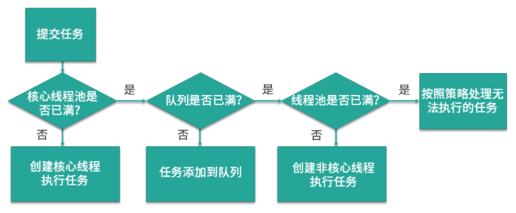
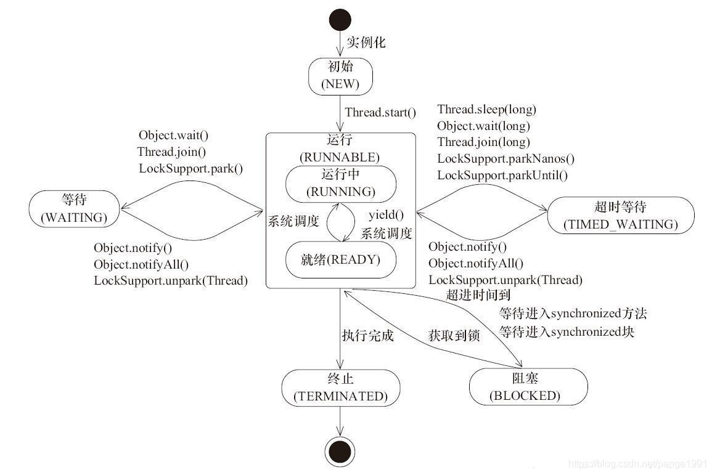

## 并发编程思维导图

### 线程的6 种状态
  NEW、RUNNABLE、BLOCKED、WAITING、TIMED_WAITING、TERMINATED
 
  
### 常见的线程池
FixedThreadPool、CachedThreadPool、ScheduledThreadPool、SingleThreadExecutor、SingleThreadScheduledExecutor 和 ForkJoinPool

### 创建线程流程
 

### 阻塞队列
ArrayBlockingQueue、LinkedBlockingQueue、SynchronousQueue、PriorityBlockingQueue 和 DelayQueue

### 线程池对于阻塞队列的选择

| 线程池 | 阻塞队列 |
| --- | --- |
| FixedThreadPool | LinkedBlockingQueue |
| SingleThreadExecutor | LinkedBlockingQueue |
| CachedThreadPool | SynchronousQueue |
| ScheduledThreadPool | DelayQueue |
| SingleThreadScheduledExecutor | DelayQueue |

### 线程配合协助
 Semaphore 信号量、CountDownLatch、CyclicBarriar 和 Condition
 
###  Java 内存模型
重排序
原子性
内存可见性
happens-before原则

