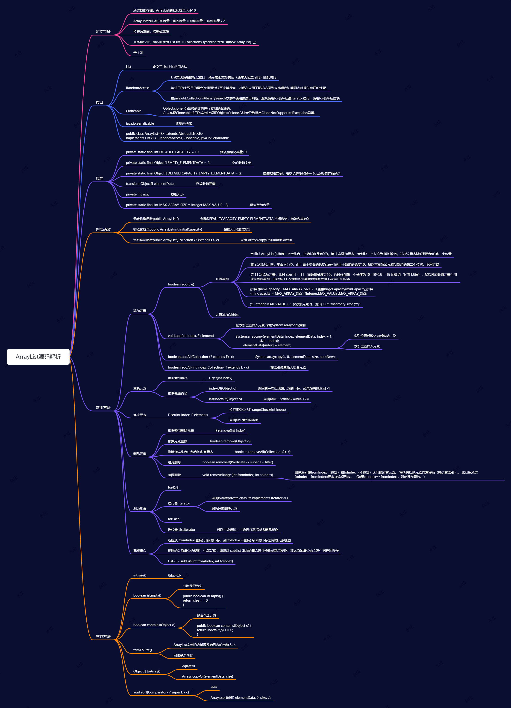

## **ArrayList源码解析思维导图**



## **常见相关问题**

### ArrayList是扩容方式

1. 通过 ArrayList() 构造一个空集合，初始长度是为0的
2. 第 1 次添加元素，会创建一个长度为10的数组，并将该元素赋值到数组的第一个位置
3. 第 2 次添加元素，集合不为空，而且由于集合的长度size+1是小于数组的长度10，所以直接添加元素到数组的第二个位置，不用扩容
4. 第 11 次添加元素，此时 size+1 = 11，而数组长度是10，这时候创建一个长度为10+10*0.5 = 15 的数组（扩容1.5倍），然后将原数组元素引用拷贝到新数组。并将第 11 次添加的元素赋值到新数组下标为10的位置。
5. 当扩容newCapacity - MAX_ARRAY_SIZE > 0 直接使用hugeCapacity(minCapacity)扩容 
   (minCapacity > MAX_ARRAY_SIZE) ?Integer.MAX_VALUE :MAX_ARRAY_SIZE
6. 第 Integer.MAX_VALUE + 1 次添加元素时，抛出 OutOfMemoryError 异常

源码如下：

```java
private void ensureCapacityInternal(int minCapacity) {
        ensureExplicitCapacity(calculateCapacity(elementData, minCapacity));
    }

private void ensureExplicitCapacity(int minCapacity) {
    modCount++;

    // overflow-conscious code
    if (minCapacity - elementData.length > 0)
        grow(minCapacity);
}
/**
     * Increases the capacity to ensure that it can hold at least the
     * number of elements specified by the minimum capacity argument.
     *
     * @param minCapacity the desired minimum capacity
     */
private void grow(int minCapacity) {
    // overflow-conscious code
    int oldCapacity = elementData.length;
    int newCapacity = oldCapacity + (oldCapacity >> 1);
    if (newCapacity - minCapacity < 0)
        newCapacity = minCapacity;
    if (newCapacity - MAX_ARRAY_SIZE > 0)
        newCapacity = hugeCapacity(minCapacity);
    // minCapacity is usually close to size, so this is a win:
    elementData = Arrays.copyOf(elementData, newCapacity);
}
private static int hugeCapacity(int minCapacity) {
    if (minCapacity < 0) // overflow
        throw new OutOfMemoryError();
    return (minCapacity > MAX_ARRAY_SIZE) ?
        Integer.MAX_VALUE :
    MAX_ARRAY_SIZE;
}
```

## ArrayList和LinkedLisL区别

1. 两个都是基于List的接口，非线程安全
2. arraylist底层使用的数组，linkedlist底层使用的是链表
3. 数组查询具有查询特定元素比较快，而插入或删除时比较慢（数组在内存中是一块连续的内存，插入或删除时会移动内存）
4. 链表不要求连续的内存，当前元素存放上一个或下一个元素的地址，查询时需要从头部开始一个一个的找，查询效率低，插入时不需要移动内存，只需改变引用指向即可，所以插入或删除效率高
5. ArrayList使用在查询多，插入或查询少的场景
6. LinkedList使用在插入或删除多，查询少的场景中