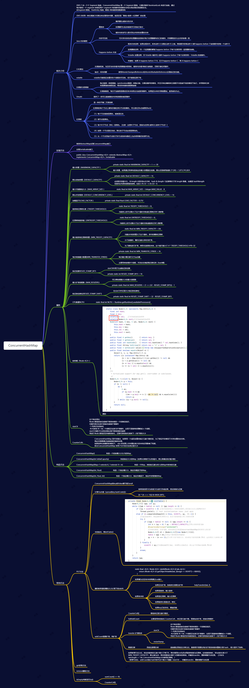

## **ConcurrentHashMap源码思维导图**



## **常见问题**

### put方法源码

```java
public V put(K key, V value) {
    return putVal(key, value, false);
}

/** Implementation for put and putIfAbsent */
final V putVal(K key, V value, boolean onlyIfAbsent) {
    if (key == null || value == null) throw new NullPointerException();
    int hash = spread(key.hashCode()); //计算hash值
    int binCount = 0;//用来记录链表的长度
    for (Node<K,V>[] tab = table;;) {//这里其实就是自旋操作，当出现线程竞争时不断自旋
        Node<K,V> f; int n, i, fh;
        if (tab == null || (n = tab.length) == 0)//如果数组为空，则进行数组初始化
            tab = initTable();//初始化数组
        // 通过hash值对应的数组下标得到第一个节点; 以volatile读的方式来读取table数组中的元素，保证每次拿到的数据都是最新的
        else if ((f = tabAt(tab, i = (n - 1) & hash)) == null) {
            //如果该下标返回的节点为空，则直接通过cas将新的值封装成node插入即可；如果cas失败，说明存在竞争，则进入下一次循环
            if (casTabAt(tab, i, null,
                         new Node<K,V>(hash, key, value, null)))
                break;                   // no lock when adding to empty bin
        }
        else if ((fh = f.hash) == MOVED)
            tab = helpTransfer(tab, f);//协助扩容
        else {//进入到这个分支，说明f是当前nodes数组对应位置节点的头节点，并且不为空
            V oldVal = null;
            synchronized (f) {//给对应的头结点加锁
                if (tabAt(tab, i) == f) {//再次判断对应下标位置是否为f节点
                    if (fh >= 0) {//头结点的hash值大于0，说明是链表
                        binCount = 1;//用来记录链表的长度
                        for (Node<K,V> e = f;; ++binCount) {//遍历链表
                            K ek;
                            //如果发现相同的key，则判断是否需要进行值的覆盖
                            if (e.hash == hash &&
                                ((ek = e.key) == key ||
                                 (ek != null && key.equals(ek)))) {
                                oldVal = e.val;
                                if (!onlyIfAbsent)//默认情况下，直接覆盖旧的值
                                    e.val = value;
                                break;
                            }
                            //一直遍历到链表的最末端，直接把新的值加入到链表的最后面
                            Node<K,V> pred = e;
                            if ((e = e.next) == null) {
                                pred.next = new Node<K,V>(hash, key,
                                                          value, null);
                                break;
                            }
                        }
                    }
                    //如果当前的f节点是一颗红黑树
                    else if (f instanceof TreeBin) {
                        Node<K,V> p;
                        binCount = 2;
                        //则调用红黑树的插入方法插入新的值
                        if ((p = ((TreeBin<K,V>)f).putTreeVal(hash, key,
                                                              value)) != null) {
                            oldVal = p.val;//同样，如果值已经存在，则直接替换
                            if (!onlyIfAbsent)
                                p.val = value;
                        }
                    }
                }
            }
            if (binCount != 0) {//说明上面在做链表操作
                //如果链表长度已经达到临界值8 就需要把链表转换为树结构
                if (binCount >= TREEIFY_THRESHOLD)
                    treeifyBin(tab, i);
                if (oldVal != null)//如果val是被替换的，则返回替换之前的值
                    return oldVal;
                break;
            }
        }
    }
    //将当前ConcurrentHashMap的元素数量加1，有可能触发transfer操作(扩容)
    addCount(1L, binCount);
    return null;
}
```


#### spread计算Hash值

```java
static final int spread(int h) {
    return (h ^ (h >>> 16)) & HASH_BITS;
}
```

#### initTable初始化表格

~~~java
private final Node<K,V>[] initTable() {
    Node<K,V>[] tab; int sc;
    while ((tab = table) == null || tab.length == 0) {
        if ((sc = sizeCtl) < 0) //被其他线程抢占了初始化的操作,则直接让出自己的CPU时间片
            Thread.yield(); // lost initialization race; just spin
        else if (U.compareAndSwapInt(this, SIZECTL, sc, -1)) {
            //通过cas操作，将sizeCtl替换为-1，标识当前线程抢占到了初始化资格
            try {
                if ((tab = table) == null || tab.length == 0) {
                    int n = (sc > 0) ? sc : DEFAULT_CAPACITY;//默认初始容量为16
                    @SuppressWarnings("unchecked")
                    //初始化数组，长度为16，或者初始化在构造ConcurrentHashMap的时候传入的长度
                    Node<K,V>[] nt = (Node<K,V>[])new Node<?,?>[n];
                    table = tab = nt;//将这个数组赋值给table
                    sc = n - (n >>> 2);//计算下次扩容的大小，实际就是当前容量的0.75倍，这里使用了右移来计算
                }
            } finally {
                sizeCtl = sc;//设置sizeCtl为sc, 如果默认是16的话，那么这个时候sc=16*0.75=12
            }
            break;
        }
    }
    return tab;
}
~~~

#### tabAt计算下标

~~~java
static final <K,V> Node<K,V> tabAt(Node<K,V>[] tab, int i) {
    return (Node<K,V>)U.getObjectVolatile(tab, ((long)i << ASHIFT) + ABASE);
}
~~~

#### addCount计数

~~~java
private final void addCount(long x, int check) {
    CounterCell[] as; long b, s;
    //判断counterCells是否为空，
    // 1. 如果为空，就通过cas操作尝试修改baseCount变量，对这个变量进行原子累加操作(做这个操作的意义是：如果在没有竞争的情况下，仍然采用baseCount来记录元素个数)
    // 2. 如果cas失败说明存在竞争，这个时候不能再采用baseCount来累加，而是通过CounterCell来记录

    if ((as = counterCells) != null ||
        !U.compareAndSwapLong(this, BASECOUNT, b = baseCount, s = b + x)) {
        CounterCell a; long v; int m;
        boolean uncontended = true;//是否冲突标识，默认为没有冲突
        //这里有几个判断
        // 1. 计数表为空则直接调用fullAddCount
        // 2. 从计数表中随机取出一个数组的位置为空，直接调用fullAddCount
        // 3. 通过CAS修改CounterCell随机位置的值，如果修改失败说明出现并发情况（这里又用到了一种巧妙的方法），
        //    调用fullAndCount Random在线程并发的时候会有性能问题以及可能会产生相同的随机数,ThreadLocalRandom.getProbe可以解决这个问题，并且性能要比Random高
        if (as == null || (m = as.length - 1) < 0 ||
            (a = as[ThreadLocalRandom.getProbe() & m]) == null ||
            !(uncontended =
              U.compareAndSwapLong(a, CELLVALUE, v = a.value, v + x))) {
            fullAddCount(x, uncontended);
            return;
        }
        if (check <= 1)//链表长度小于等于1，不需要考虑扩容
            return;
        s = sumCount();//统计ConcurrentHashMap元素个数
    }
    if (check >= 0) {//如果binCount>=0，标识需要检查扩容
        Node<K,V>[] tab, nt; int n, sc;
        //s标识集合大小，如果集合大小大于或等于扩容阈值（默认值的0.75）
        // 并且table不为空并且table的长度小于最大容量
        while (s >= (long)(sc = sizeCtl) && (tab = table) != null &&
               (n = tab.length) < MAXIMUM_CAPACITY) {
            int rs = resizeStamp(n);//这里是生成一个唯一的扩容戳
            if (sc < 0) {
                //sc<0，也就是sizeCtl<0，说明已经有别的线程正在扩容了
                // 这5个条件只要有一个条件为true，说明当前线程不能帮助进行此次的扩容，直接跳出循环
                // sc >>> RESIZE_STAMP_SHIFT!=rs 表示比较高RESIZE_STAMP_BITS位生成戳和rs是否相等，相同
                // sc=rs+1 表示扩容结束
                // sc==rs+MAX_RESIZERS 表示帮助线程线程已经达到最大值了
                // nt=nextTable -> 表示扩容已经结束
                // transferIndex<=0 表示所有的transfer任务都被领取完了，没有剩余的hash桶来给自己自己好这个线程来做transfer
                if ((sc >>> RESIZE_STAMP_SHIFT) != rs || sc == rs + 1 ||
                    sc == rs + MAX_RESIZERS || (nt = nextTable) == null ||
                    transferIndex <= 0)
                    break;
                if (U.compareAndSwapInt(this, SIZECTL, sc, sc + 1))//当前线程尝试帮助此次扩容，如果成功，则调用transfer
                    transfer(tab, nt);
            }
            //如果当前没有在扩容，那么 rs 肯定是一个正数，通过 rs <<RESIZE_STAMP_SHIFT 将 sc 设置
            // 为一个负数， 2 表示有一个线程在执行扩容
            else if (U.compareAndSwapInt(this, SIZECTL, sc,
                                         (rs << RESIZE_STAMP_SHIFT) + 2))
                transfer(tab, null);
            s = sumCount();// 重新计数，判断是否需要开启下一轮扩容
        }
    }
}
~~~

#### sumCount计数

~~~java
final long sumCount() {
    CounterCell[] as = counterCells; CounterCell a;
    long sum = baseCount;
    if (as != null) {
        for (int i = 0; i < as.length; ++i) {
            if ((a = as[i]) != null)
                sum += a.value;
        }
    }
    return sum;
}
~~~


