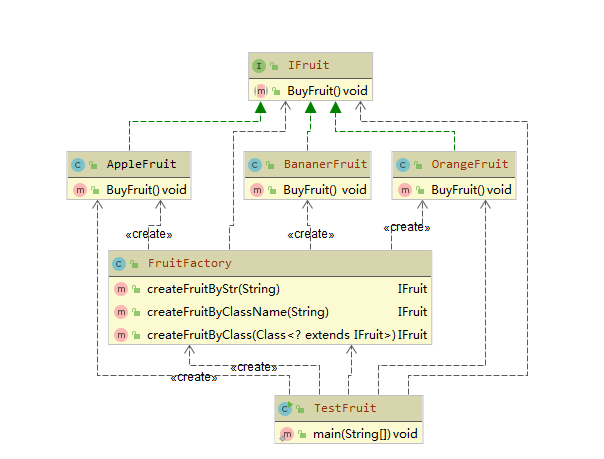
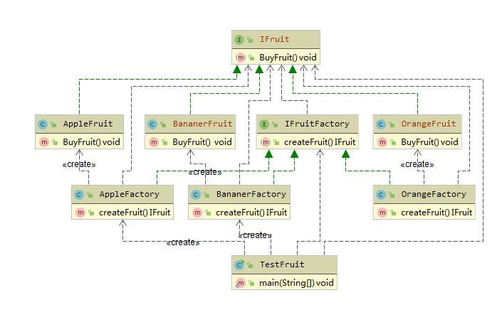
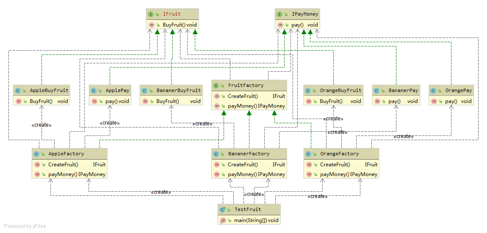

# **工厂模式**
## 1. 简单工厂模式
简单工厂模式（Simple Factory Pattern）是指由一个工厂对象决定创建出哪一种产品类 的实例，但它不属于GOF，23 种设计模式（参考资料： http://en.wikipedia.org/wiki/Design_Patterns#Patterns_by_Type）。简单工厂适用 于工厂类负责创建的对象较少的场景，且客户端只需要传入工厂类的参数，对于如何创 建对象的逻辑不需要关心。
1、创建购买水果的接口
2、实现购买水果的接口，苹果，香蕉，橘子购买实现类
3、创建工厂，根据输入条件返回购买水果接口
4、客户端根据条件购买相应的水果

## 2. 工厂方法模式
工厂方法模式（Fatory Method Pattern）是指定义一个创建对象的接口，但让实现这个 接口的类来决定实例化哪个类，工厂方法让类的实例化推迟到子类中进行。在工厂方法 模式中用户只需要关心所需产品对应的工厂，无须关心创建细节，而且加入新的产品符 合开闭原则。
1、创建购买水果的接口
2、实现购买水果的接口，苹果，香蕉，橘子购买实现类
3、创建工厂接口返回水果接口
4、创建苹果购买工厂，香蕉购买工厂，橘子购买工厂
5、客户端根据水果工厂进行购买相应的水果
- 
## 3. 抽象工厂模式
抽象工厂模式（Abastract Factory Pattern）是指提供一个创建一系列相关或相互依赖 对象的接口，无须指定他们具体的类。客户端（应用层）不依赖于产品类实例如何被创 建、实现等细节，强调的是一系列相关的产品对象（属于同一产品族）一起使用创建对 象需要大量重复的代码。需要提供一个产品类的库，所有的产品以同样的接口出现，从 而使客户端不依赖于具体实现。
1、创建挑选水果接口和付钱接口
2、创建挑选苹果实现类，挑选香蕉实现类，挑选橘子实现类
3、创建苹果付钱实现类，香蕉付钱实现类，橘子付钱实现类
4、创建苹果工厂可以挑选苹果，并付苹果钱接口，香蕉工厂，橘子工厂
5、客户端购买苹果，先挑选苹果再进行付钱
- 

