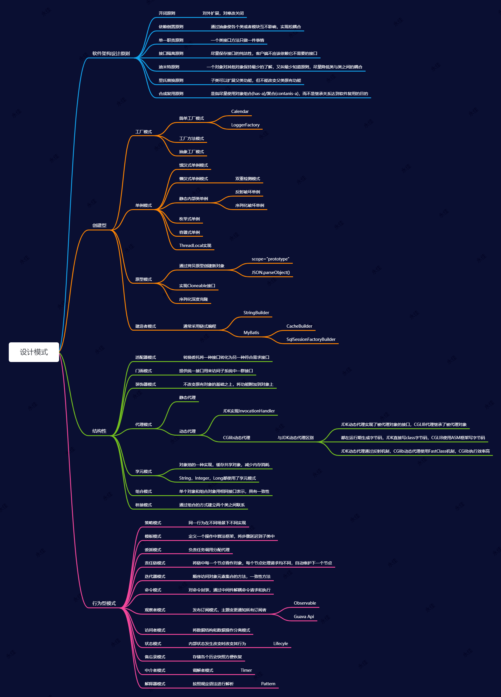
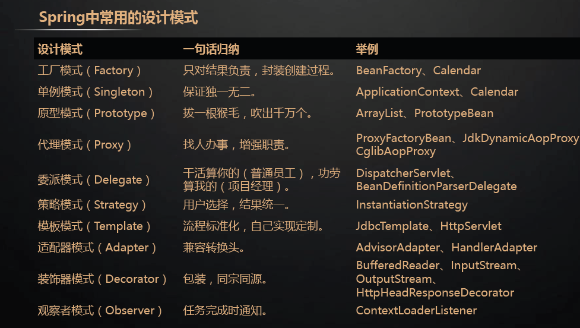

## **设计模式思维导图总结**

## 相关问题：
### 用一句自己的话总结学过的设计模式

创建型：工厂方法模式（Factory Method）、抽象工厂模式（Abstract Factory）、建造者模式（Builder）、原型模式（Prototype）、单例模式 （Singleton）
结构型：适配器模式(Adapter)、桥接模式(bridge)、组合模式(Composite)、装饰器模式(Decorator) 门面模式(Facade)、享元模式(Flyweight)、代理模式(Proxy)

行为型：解释器模式（Interpreter）、模板方法模式（Template Method）、责任链模式（Chain of Responsibility） 命令模式（Command）、迭代器模式（Iterator）、调解者模式（Mediator）、备忘录模式（Memento）
 观察者模式（Observer）、状态模式（State）、策略模式（Strategy）、访问者模式（Visitor）

## 设计模式之间的关联和对比

单例模式和工厂模式

策略模式和工厂模式

策略模式和委派模式

模板方法模式和工厂方法模式

模板方法模式和策略模式

装饰者模式和静态代理模式

装饰者模式和适配器模式

适配器模式和静态代理模式

适配器模式和策略模式

#### 策略模式和委派模式分析

##### **委派模式**

###### 1. 定义

委派模式（Delegate Pattern）的基本作用就是负责任务的调用和分配任务，跟代理模式很像，可以看做是一种特殊情况下的静态代理的全权代理，但是代理模式注重过程，而委派模式注重结果。

###### 2. 适用场景

1、老板给经理分配任务，由经理分给员工任务；

##### **策略模式**

###### 1. 定义

策略模式（Strategy Pattern）是指定义了算法家族、分别封装起来，让它们之间可以互相替换，此模式让算法的变化不会影响到使用算法的用户。
可以避免多重分支的if...else...和switch语句

###### 2. 适用场景

1、假如系统中有很多类，而他们的区别仅仅在于他们的行为不同。
2、一个系统需要动态地在几种算法中选择一种。

##### 3.策略模式的优缺点

优点：
1、策略模式符合开闭原则。
2、避免使用多重条件转移语句，如if...else...语句、switch 语句
3、使用策略模式可以提高算法的保密性和安全性。
缺点：
1、客户端必须知道所有的策略，并且自行决定使用哪一个策略类。
2、代码中会产生非常多策略类，增加维护难度。

