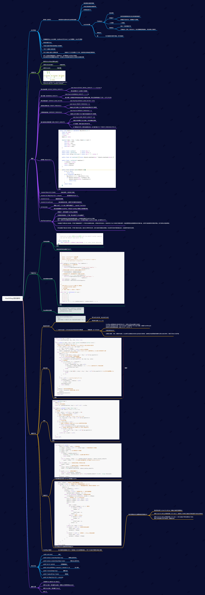

# **HashMap源码思维导图**



# 源码片段

## 有参构造函数

```java
/**
  * 
  *
  * @param  initialCapacity 初始化容量
  * @param  loadFactor      加载因子
  * @throws IllegalArgumentException if the initial capacity is negative
  *         or the load factor is nonpositive
  */
public HashMap(int initialCapacity, float loadFactor) {
    //初始化容量不能小于 0 ，否则抛出异常
    if (initialCapacity < 0)
        throw new IllegalArgumentException("Illegal initial capacity: " +
                                           initialCapacity);
    //如果初始化容量大于2的30次方，则初始化容量都为2的30次方
    if (initialCapacity > MAXIMUM_CAPACITY)
        initialCapacity = MAXIMUM_CAPACITY;
    //如果加载因子小于0，或者加载因子是一个非数值，抛出异常
    if (loadFactor <= 0 || Float.isNaN(loadFactor))
        throw new IllegalArgumentException("Illegal load factor: " +
                                           loadFactor);
    this.loadFactor = loadFactor;
    this.threshold = tableSizeFor(initialCapacity);
}

/**
  * 返回大于等于initialCapacity的最小的二次幂数值。
  * >>> 操作符表示无符号右移，高位取0。
  * | 按位或运算
  * 如：3输出4 5输出8 9，15输出16，100输出128
  */
static final int tableSizeFor(int cap) {
    int n = cap - 1;
    n |= n >>> 1;
    n |= n >>> 2;
    n |= n >>> 4;
    n |= n >>> 8;
    n |= n >>> 16;
    return (n < 0) ? 1 : (n >= MAXIMUM_CAPACITY) ? MAXIMUM_CAPACITY : n + 1;
}
```


## 添加源码

~~~java
/**
  * 添加元素.
  */
public V put(K key, V value) {
    return putVal(hash(key), key, value, false, true);
}
final V putVal(int hash, K key, V value, boolean onlyIfAbsent,boolean evict) {
    Node<K,V>[] tab; Node<K,V> p; int n, i;
    //如果table为null或者长度为0，则进行初始化 resize()用于扩容，初始化没有实际分配空间
    if ((tab = table) == null || (n = tab.length) == 0)
        n = (tab = resize()).length;
    if ((p = tab[i = (n - 1) & hash]) == null)//key进行hash取模运算
        tab[i] = newNode(hash, key, value, null);//tab[i] 为null，直接将新的key-value插入到计算的索引i位置
    else { //tab[i] 不为null，表示该位置已经有值了
        Node<K,V> e; K k;
        if (p.hash == hash &&((k = p.key) == key || (key != null && key.equals(k))))
            e = p;//节点key已经有值了，直接用新值覆盖
        else if (p instanceof TreeNode)//该链是红黑树
            e = ((TreeNode<K,V>)p).putTreeVal(this, tab, hash, key, value);
        else {//该链是链表
            for (int binCount = 0; ; ++binCount) {
                if ((e = p.next) == null) {
                    p.next = newNode(hash, key, value, null);
                    if (binCount >= TREEIFY_THRESHOLD - 1) // -1 for 1st链表长度大于8，转换成红黑树
                        treeifyBin(tab, hash);
                    break;
                }
                if (e.hash == hash &&((k = e.key) == key || (key != null && key.equals(k))))//key已经存在直接覆盖value
                    break;
                p = e;
            }
        }
        if (e != null) { // existing mapping for key
            V oldValue = e.value;
            if (!onlyIfAbsent || oldValue == null)
                e.value = value;
            afterNodeAccess(e);//LinkedHashMap 是继承的 HashMap，并且重写了该方法
            return oldValue;//如果新插入的key存在，则返回原key对应的value值
        }
    }
    ++modCount;//用作修改和新增快速失败
    if (++size > threshold)//超过最大容量，进行扩容
        resize();
    afterNodeInsertion(evict);//LinkedHashMap 是继承的 HashMap，并且重写了该方法
    return null;//如果新插入的key不存在，则返回null
}
~~~

## 查找源码

~~~java
public V get(Object key) {
    Node<K,V> e;
    // 对 key 进行哈希操作
    return (e = getNode(hash(key), key)) == null ? null : e.value;
}
final Node<K,V> getNode(int hash, Object key) {
    Node<K,V>[] tab; Node<K,V> first, e; int n; K k;
    // 非空判断
    if ((tab = table) != null && (n = tab.length) > 0 &&
        (first = tab[(n - 1) & hash]) != null) {
        // 判断第一个元素是否是要查询的元素
        if (first.hash == hash && // always check first node
            ((k = first.key) == key || (key != null && key.equals(k))))
            return first;
        // 下一个节点非空判断
        if ((e = first.next) != null) {
            // 如果第一节点是树结构，则使用 getTreeNode 直接获取相应的数据
            if (first instanceof TreeNode)
                return ((TreeNode<K,V>)first).getTreeNode(hash, key);
            do {// 非树结构，循环节点判断 hash 相等并且 key 相同，则返回此节点
                if (e.hash == hash &&
                    ((k = e.key) == key || (key != null && key.equals(k))))
                    return e;
            } while ((e = e.next) != null);
        }
    }
    return null;
}
~~~


## 扩容源码

~~~java
final Node<K,V>[] resize() {
        Node<K,V>[] oldTab = table;// 扩容前的数组
        int oldCap = (oldTab == null) ? 0 : oldTab.length;// 扩容前的数组的大小和阈值
        int oldThr = threshold;
        int newCap, newThr = 0;//定义新数组的大小和阈值
        if (oldCap > 0) {
            if (oldCap >= MAXIMUM_CAPACITY) {
                threshold = Integer.MAX_VALUE;// 超过最大值就不再扩容了
                return oldTab;
            }
            else if ((newCap = oldCap << 1) < MAXIMUM_CAPACITY &&oldCap >= DEFAULT_INITIAL_CAPACITY)
                newThr = oldThr << 1; // 扩大容量为当前容量的两倍，但不能超过 MAXIMUM_CAPACITY
        }
        else if (oldThr > 0) // 当前数组没有数据，使用初始化的值
            newCap = oldThr;
        else {               // 如果初始化的值为 0，则使用默认的初始化容量
            newCap = DEFAULT_INITIAL_CAPACITY;
            newThr = (int)(DEFAULT_LOAD_FACTOR * DEFAULT_INITIAL_CAPACITY);
        }
        if (newThr == 0) {// 如果新的容量等于 0
            float ft = (float)newCap * loadFactor;
            newThr = (newCap < MAXIMUM_CAPACITY && ft < (float)MAXIMUM_CAPACITY ?(int)ft : Integer.MAX_VALUE);
        }
        threshold = newThr;
        @SuppressWarnings({"rawtypes","unchecked"})
        Node<K,V>[] newTab = (Node<K,V>[])new Node[newCap];
        table = newTab;// 开始扩容，将新的容量赋值给 table
        if (oldTab != null) {// 原数据不为空，将原数据复制到新 table 中
            for (int j = 0; j < oldCap; ++j) {// 根据容量循环数组，复制非空元素到新 table
                Node<K,V> e;
                if ((e = oldTab[j]) != null) {
                    oldTab[j] = null;
                    if (e.next == null)// 如果链表只有一个，则进行直接赋值
                        newTab[e.hash & (newCap - 1)] = e;
                    else if (e instanceof TreeNode)// 红黑树相关的操作
                        ((TreeNode<K,V>)e).split(this, newTab, j, oldCap);
                    else { // 链表复制，JDK 1.8 扩容优化部分
                        Node<K,V> loHead = null, loTail = null;
                        Node<K,V> hiHead = null, hiTail = null;
                        Node<K,V> next;
                        do {
                            next = e.next;
                            if ((e.hash & oldCap) == 0) {// 原索引
                                if (loTail == null)
                                    loHead = e;
                                else
                                    loTail.next = e;
                                loTail = e;
                            }else {// 原索引 + oldCap
                                if (hiTail == null)
                                    hiHead = e;
                                else
                                    hiTail.next = e;
                                hiTail = e;
                            }
                        } while ((e = next) != null);
                        if (loTail != null) {// 将原索引放到哈希桶中
                            loTail.next = null;
                            newTab[j] = loHead;
                        }
                        if (hiTail != null) {// 将原索引 + oldCap 放到哈希桶中
                            hiTail.next = null;
                            newTab[j + oldCap] = hiHead;
                        }
                    }
                }
            }
        }
        return newTab;
    }
~~~

## 元素遍历

~~~java
//1、分别获取key和value的集合
for(String key : map.keySet()){
     System.out.println(key);
}
for(Object value : map.values()){
    System.out.println(value);
}
~~~

~~~java
//2、获取key集合，然后遍历key，根据key得到 value
Set<String> keySet = map.keySet();
for(String str : keySet){
   System.out.println(str+"-"+map.get(str));
}
~~~

~~~java
//3、得到 Entry 集合，然后遍历 Entry
Set<Map.Entry<String,Object>> entrySet = map.entrySet();
for(Map.Entry<String,Object> entry : entrySet){
     System.out.println(entry.getKey()+"-"+entry.getValue());
}
~~~

~~~java
//4、迭代
Iterator<Map.Entry<String,Object>> iterator = map.entrySet().iterator();
while(iterator.hasNext()){
    Map.Entry<String,Object> mapEntry = iterator.next();
    System.out.println(mapEntry.getKey()+"-"+mapEntry.getValue());
}
~~~


# 常见面试题目

## HashMap和TreeMap区别

#### HashMap：

1. 数组加链表方式存储key/value,  
2. 线程非安全，
3. 允许null作为key和value，
4. key不可以重复，value允许重复，
5. 不保证元素迭代顺序是按照插入时的顺序；

#### TreeMap

1. 基于红黑树，
2. 线程非安全，
3. 不允许null作为key，
4. key不可以重复，value允许重复，
5. 存入TreeMap的元素应当实现Comparable接口或者实现Comparator接口才能按照排序后的顺序遍历元素


## JDK 1.8 HashMap 扩容时做了哪些优化

JDK 1.8 在扩容时并没有像 JDK 1.7 那样，重新计算每个元素的哈希值，而是通过高位运算（e.hash & oldCap）来确定元素是否需要移动，

使用 e.hash & oldCap 得到的结果，高一位为 0，当结果为 0 时表示元素在扩容时位置不会发生任何变化，

使用 e.hash & oldCap 得到的结果，高一位为 1，表示元素在扩容时位置发生了变化，新的下标位置等于原下标位置 + 原数组长度

## 加载因子为什么是 0.75

空间和时间效率的一个平衡，默认选择0.75 作为加载因子

当加载因子设置比较大的时候，扩容的门槛就被提高了，扩容发生的频率比较低，占用的空间会比较小，但此时发生 Hash 冲突的几率就会提升，因此需要更复杂的数据结构来存储元素，这样对元素的操作时间就会增加，运行效率也会因此降低；

而当加载因子值比较小的时候，扩容的门槛会比较低，因此会占用更多的空间，此时元素的存储就比较稀疏，发生哈希冲突的可能性就比较小，因此操作性能会比较高。


## 当有哈希冲突时，HashMap 是如何查找并确认元素的？

 JDK 1.7 时 HashMap 是由数组和链表组成的，

 JDK 1.8 则新增了红黑树结构，当链表长度达到 8 并且容器达到 64 时会转换为红黑树存储，以提升元素的操作性能

HashMap 底层数组的长度总是2的n次方，这是HashMap在速度上的优化。
当 length 总是2的n次方时，hash & (length-1)运算等价于对 length 取模，也就是 hash%length
但是&比%具有更高的效率。比如 n % 32 = n & (32 -1)


